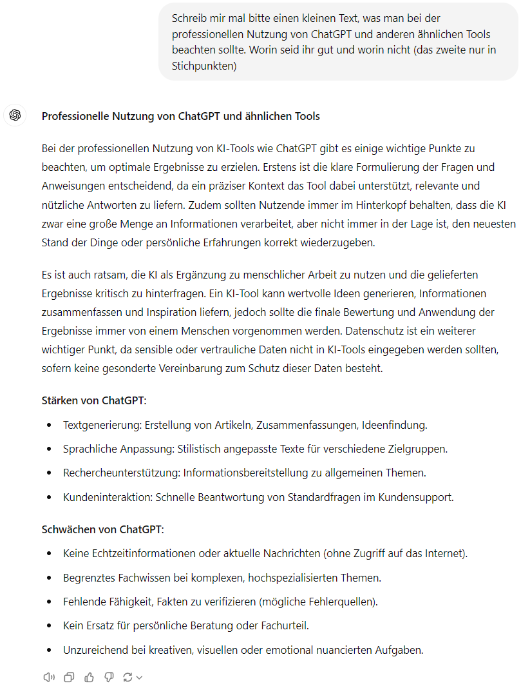

# Professioneller Umgang mit ChatGPT

Fragen wir doch mal ChatGPT, was es meint, wie man mit ihm umgehen sollte:

😍 'Gibt es eine Funktion, die ... für mich tut?'

😃 'Bei mir eine Anwendung in der Programmiersprache, die folgende Datenverarbeitung vornimmt ...',

'Wo ist der Fehler in folgendem Code:'

'Erkläre mir für jede Zeile genau, was Sie tut'

😐 

😫

Don't: Interne Daten ausgeben

Achtung: ChatGPT lügt gerne. Wenn es etwas nicht weiß, dann denkt es sich die Antwort einfach aus. So gäbe es auf
einmal z.B. völlig neuartige Funktionen, laut GPT zwar unser Problem lösen, in Wirklichkeit aber gar nicht existieren.

kann lange texte nicht perfekt übernehmen

