# Funktionen

Bisher sind alle unsere Codebeispiel so geschrieben, dass dieser einmalig ausgeführt 
wird und dann nicht mehr gebraucht wird. Das ist normalerweise nicht der Fall.
Normalerweise werden Codeabschnitte immer wieder und in verschiedenen Kontexten aufgerufen.
Zum Beispiel wollen wir Code bereitstellen, um den BMI einer Person zu berechnen.
Den Code möchte man einerseits für beliebige Personen ausführen und andererseits an verschiedenen Stellen
(z.B. bei verschiedenen Anzeigen in einer App).

Die wichtigste Möglichkeit zur Strukturierung des Codes sind Funktionen bzw. Methoden.

<div class="grid" markdown>
<div markdown>
In Python ist eine **Funktion** eine selbstständige, wiederverwendbare Codeeinheit, die dazu dient,
**eine bestimmte Aufgabe** zu erledigen. Funktionen können Parameter akzeptieren, 
Operationen durchführen und einen können Rückgabewert liefern.

Beliebte Metaphern, um sie Funktionen vorzustellen sind:

* Eine Funktion, ist eine Maschine, in die wir Argumente stopfen, damit sie diese verarbeitet und uns Ergebnisse liefert.
* Eine Funktion ist wie ein Rezept. Es erwartet bestimmte Zutaten und wenn wir der Anleitung folgen, erhalten wir eine raffinierte Mahlzeit.

```mermaid
graph TD;
    A([Parameter]) --> B[Funktion] --> C([Rückgabewert])
    A1([Zutaten]) --> B1[Rezept] --> C1([Mahlzeit])
    A2([Rohstoffe]) --> B2[Maschine] --> C2([Produkt])
```

</div>


</div>

{{ task(file="tasks/funktionen_identifizieren_1.yaml") }}

## Eigene Funktionen definieren

Im folgenden Code wird unsere erste eigene Funktion `hoch()` *def*iniert und diese dann drei mal aufgerufen wird:

```{ .python hl_lines="1-3"}
def hoch(): # (1)!
    print("Er lebe...") # (2)!
    print("HOCH!")

hoch() # (3)!
hoch() # (4)!
hoch() # (5)!
```

1. Die Funktion wird it dem Schlüsselwort `def` definiert. Wir geben ihr den Namen `hoch`. Da sie keine Parameter hat schreiben wir hier einfach runde Klammern `()` und danach einen `:` (so wie beim `if`).<br/>Diese Erste Zeile einer Funktion wird **Funktionskopf** genannt.
2. Die nun eingerückten Zeilen sind der **Funktionsrumpf** oder **Funktionskörper**. Diese werden nur durchgeführt, wenn die Funktion aufgerufen wird.
3. Wir führen in dieser Zeile die Funktion aus. Dazu schreiben wir den Funktionsnamen auf, gefolgt von runden Klammern.
4. Wir führen die Funktion erneut aus...
5. Und noch ein drittes mal🥳

{{ python_tutor("""def hoch():
    print('Er lebe...')
    print('HOCH!')

hoch()
hoch()
hoch()""") }}

{{ task(file="tasks/funktionen_ablauf_beschreiben_0.yaml") }}


TODO: Hier leichte verständnisaufgaben rein

* def einsetezen
* voraussagen, was passieren wird

## Funktionen mit Parametern

Über Parameter können wir dafür sorgen, dass Funktionen nicht immer exakt das Gleiche tun, sondern, eben abhängig von 
den übergebenen Parametern, in ihren Ergebnissen variieren, obwohl die Rechenvorschriften gleich sind.

Im Bild gesprochen: Ein Rezept besteht einerseits aus einer Liste von Zubereitungsschritten (Funktionskörper)
aber auch aus einer Auflistung der Zutaten (Parameter). Nun kann man zwei verschiedene Kuchen mit demselben Rezept 
backen, indem man die Zutaten variiert. So macht es z.B. einen Unterschied welche konkrete Apfelsorte man in einem
Apfelkuchen verwendet.

Definieren wir Parameter in einer Funktion, so müssen wir diese beim Funktionsaufruf mit Klammern angeben:

<div class="grid" markdown>
<div markdown>

```python
def print_greeting(name, age): # (1)!
    print(f"Hallo {name}!") # (2)!
    if age > 65: # (3)!
        print(f"Geht es?") # (4)! 

print_greeting("Jörg", 68) # (5)!
print_greeting("Kevin", 20) # (6)!
```

1. Bei der Funktionsdefinition werden alle Parameter mit `,` getrennt in die runden Klammern geschrieben.
2. Der erste übergebene Parameter wird hier in der Konsolenausgabe verwendet.
3. Der zweite übergebene Parameter wird hier in der Bedingung benutzt.
4. Auch diese zwei Mal eingerückte Zeile gehört noch zum Funktionsrumpf.
5. Die Funktion wird hier aufgerufen. Die Argumente sind `Jörg` und `#!pyhton 68`, welche für die Paramter `name` und `age` eingesetzt werden.
6. Die Funktion wird hier erneut aufgerufen, aber mit anderen Argumenten. Dies führt zu anderen Konsolenausgaben als bei der ersten Durchführung. 

</div>

<div markdown>

</div>
</div>

{{ python_tutor("""def print_greeting(name, age):
    print(f'Hallo {name}!')
    if age > 65:
        print(f'Geht es?') 

print_greeting('Jörg', 68)
print_greeting('Kevin', 20)""") }}

TODO: Aufgaben

## Rückgabewerte

Nun ist noch wichtig zu erwähnen, dass Funktionen nicht nur verarbeiten, sondern auch ein
Ergebnis am Ende ihrer Durchführung zurückgeben können. Der Wert der zurückgegeben werden soll steht in einer
Zeile mit einem vorangehenden `return`.

<div class="grid" markdown>
<div markdown>

```python
def quadrat(zahl): # (1)!
    return zahl * zahl # (2)!

x = 4 # (3)!
q = quadrat(x) # (4)!

print(f"{x}² = {q}") # (5)!
```

1. Beim Funktionskopf sagen wir, dass es einen Paramter gibt. Dass es eine Rückgabe geben wird, lässt sich hier _nicht_ erkennen.
2. Der Parameter `zahl` wird mit sich selbst multipliziert und das Ergebnis dann **zurückgegeben**, da ein `return` am anfang der eingerückten Zeile steht. 
3. Wir speichern in der Variablen `x` das Argument.
4. Wir übergeben `x` an die Funktion und speichern die Rückgabe in der Variablen `q`.
5. Wir geben die Ergebnisse fein säuberlich auf der Konsole aus.

</div>

<div markdown>

</div>
</div>

{{ python_tutor("""def quadrat(zahl):
    return zahl * zahl

x = 4
q = quadrat(x)

print(f'{x}² = {q}')""") }}

TODO: Einfache Aufgabe hinzufügen
schreibe eine Funktion, die Prüft, ob das erste und zweite und dritte Element einer Liste gleich sind.

{{ task(file="tasks/funktionen_lesen_komplex.yaml") }}

